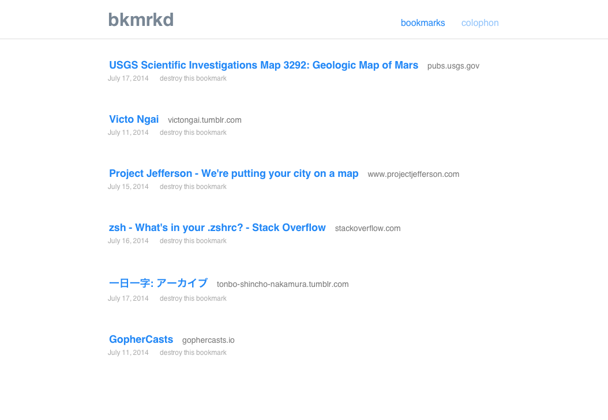
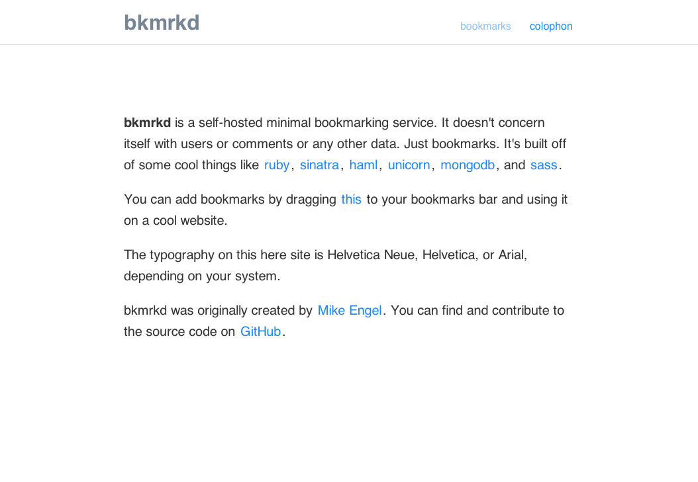

bkmrkd
======

Bkmrkd is a self-hosted, lightweight bookmarking service running on [node.js](https://nodejs.org), [react](https://facebook.github.io/react), and [rethinkdb](https://rethinkdb.com).




# installation

## assumptons

1. You have node.js >= 0.12.0 installed
2. You have rethinkdb installed and running

## running

```shell
# install the required modules
npm install

# run gulp for the first time
gulp

# if you want to run locally
npm start

# to daemonize with pm2
npm run prod
```

# running in a production environment
So you want to run this for real. On the web. That's awesome. Everyone will want this to be setup differently, but this is how I've approached it.

1. Proxy through nginx. Listen on port 80 for a domain/subdomain and proxy_pass to the app running on port 3000.
2. Use SSL certs (not required) to avoid a new window opening when bookmarking things.
3. Use a variety of startup scripts and backup scripts.

# contributing
Please make a pull request! bkmrkd follows the [js standard](https://github.com/feross/standard) styleguide.

# license
[MIT](LICENSE.md)
