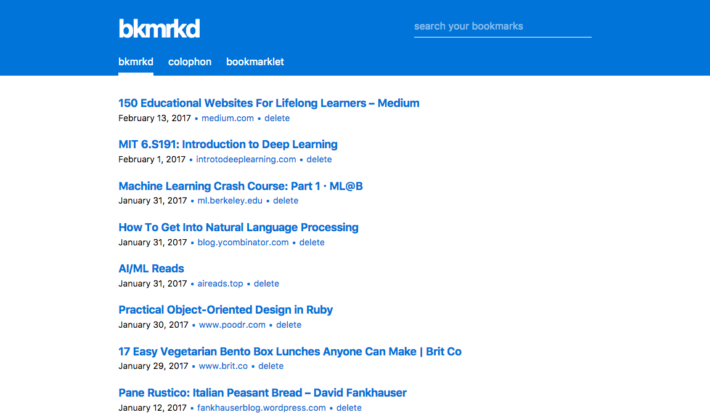
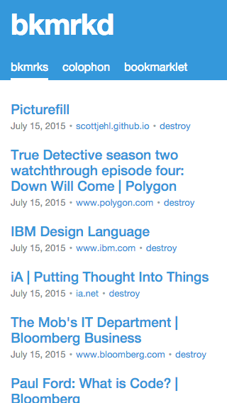
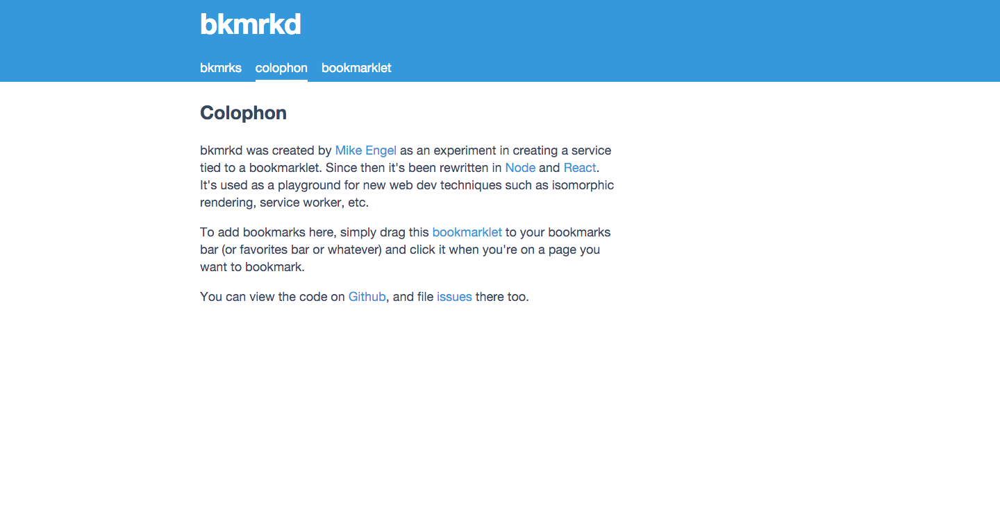

bkmrkd
======

[](https://travis-ci.org/mike-engel/bkmrkd)


Bkmrkd is a self-hosted, lightweight bookmarking service running on [node.js](https://nodejs.org), [react](https://facebook.github.io/react), and [rethinkdb](https://rethinkdb.com).

[screenshots](#screenshots)  
[installation](#installation)  
[migrating from 1.0 to 2.0](#migrating-from-10-to-20)  
[running in a production environment](#running-in-a-production-environment)  
[contributing](#contributing)  
[license](LICENSE.md)

# screenshots
## desktop


## mobile


## colophon


# installation

## assumptons

1. You have node.js >= 4.2 installed
2. You have rethinkdb installed and running

## running

```shell
# install the required modules
npm install

# if you want to run locally
npm start

# to daemonize with pm2
npm run prod
```

## saving

Simply drag the bookmarklet to your bookmarks bar and click it on a webpage you want to save. Simple.

# migrating from 1.0 to 2.0

I don't think there are enough instances of bkmrkd (plus it didn't work that well) to warrant an upgrade guide. If you want one though, let me know and I'll create a guide. You can also check out migrating from mongodb to rethinkdb.

# running in a production environment
So you want to run this for real. On the web. That's awesome. Everyone will want this to be setup differently, but this is how I've approached it.

1. Proxy through nginx. Listen on port 80 for a domain/subdomain and proxy_pass to the app running on port 3000.
2. Use SSL certs to avoid a new window opening when bookmarking things.
3. Use a variety of startup scripts and backup scripts.

# contributing
Please make a pull request! bkmrkd follows the [js standard](https://github.com/feross/standard) styleguide.

# license
[MIT](LICENSE.md)
