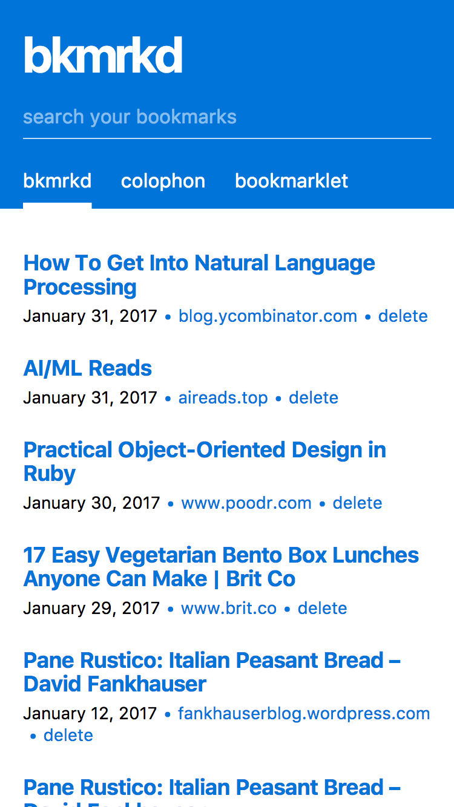

bkmrkd
======

[](https://travis-ci.org/mike-engel/bkmrkd)


bkmrkd is a self-hosted, lightweight bookmarking service running on [node.js](https://nodejs.org), [react](https://facebook.github.io/react), and [rethinkdb](https://rethinkdb.com).

[screenshots](#screenshots)  
[installation](#installation)  
[running in a production environment](#running-in-a-production-environment)  
[migrating from 1.0 to 2.0](#migrating-from-10-to-20)  
[contributing](#contributing)  
[license](LICENSE.md)

# screenshots
## desktop


## mobile


## colophon


# installation

## assumptons

1. You have node.js >= 4.2 installed
2. You have rethinkdb installed and running

## running bkmrkd

With version `2.3.0`, there are a couple of options to run bkmrkd. You can run it with one of the npm scripts, programmatically, or as a global command.

### npm script

There are npm scripts for development, staging, and production. This is the only one that doesn't work if you're using this from npm.

```shell
# install the required modules
npm install

# if you want to run locally
npm start

# for testing daemonized with pm2
npm run stage
npm run stage:restart
npm run stage:stop

# for production daemonized with pm2
# unless you put your SSL certs in the `ssl` directory
# you'll want to provide the path with an env variable
BKMRKD_CONFIG_PATH=/path/to/config/file npm run prod
BKMRKD_CONFIG_PATH=/path/to/config/file npm run prod:restart
npm run prod:stop
```

### programmatically

If you'd like to mount bkmrkd inside another app/node script, this is totally do-able too. The module exports both the express app and the [SPDY](https://github.com/indutny/node-spdy) server.

It's important to note here, however, that if you want to use the SPDY server bundled, you need to either move your certs into `./ssl/server.crt` and `./ssl/server.key`. You can also specify the path to your config (relative to your cwd) by setting the `BKMRKD_CONFIG_PATH` environment variable.

```javascript
const bkmrkdApp = require('bkmrkd').app
const bkmrkdServer = require('bkmrkd').server

// mount the app as you will
app.use('/bkmrkd', bkmrkdApp)

// run the server with some other logic around it
bkmrkdServer.listen(3000)
```

### global command

Upon installation, npm will symlink a bkmrkd binary into a folder in your path. The command is `bkmrkd`, and there are a few options you can provide.

```shell
Usage:
bkmrkd [options]

Options:
--daemon, -d   Daemonize the bkmrkd process with pm2
--config, -c   The path to your config file for bkmrkd
  --port, -p   The port that bkmrkd should bind to. Defaults to 3000. Precedence is given to the config file
  --help, -h   Print this help info
```

## saving

Simply drag the bookmarklet to your bookmarks bar and click it on a webpage you want to save. Simple.

# running in a production environment
So you want to run this for real. On the web. That's awesome. Everyone will want this to be setup differently, but this is how I've approached it.

1. Proxy through nginx. Listen on port 80 for a domain/subdomain and proxy_pass to the app running on port 3000.
2. Use SSL certs to avoid a new window opening when bookmarking things.
3. Use a variety of [startup scripts](#running-bkmrkd) and [backup](http://rethinkdb.com/docs/backup/) scripts.

# developing

To work on bkmrkd locally, you'll want to start the node server and run gulp.

```shell
# make sure rethinkdb is running
rethinkdb --daemon

# start the server in development mode
npm start

# in another window or tab, start gulp and watch for file changes
gulp
```

# migrating from 1.0 to 2.0

I don't think there are enough instances of bkmrkd (plus it didn't work that well) to warrant an upgrade guide. If you want one though, let me know and I'll create a guide. You can also check out migrating from mongodb to rethinkdb.

# contributing

Please make a pull request! bkmrkd follows the [js standard](https://github.com/feross/standard) styleguide.

# Roadmap

To keep track of the roadmap, I'm using [issues](https://github.com/mike-engel/bkmrkd/issues), and more specifically, [milestones](https://github.com/mike-engel/bkmrkd/milestones).

# [changelog](CHANGELOG.md)

# license
[MIT](LICENSE.md)
